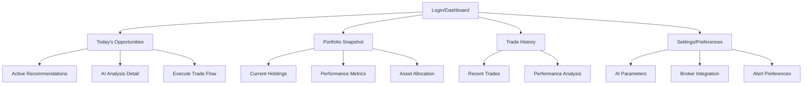

# E*TRADE Python Client UI/UX Specification

## Introduction

This document defines the user experience goals, information architecture, user flows, and visual design specifications for E*TRADE Python Client's user interface. It serves as the foundation for visual design and frontend development, ensuring a cohesive and user-centered experience.

## Overall UX Goals & Principles

### Target User Personas

**Primary: The Efficiency-Focused Trader**
- Experienced trader with active portfolio management needs
- Technically capable but seeks to eliminate analysis paralysis  
- Values speed, precision, and actionable insights over educational content
- Main pain point: Emotional bias and decision overwhelm in fast markets

**Secondary: The Data-Driven Investor** 
- Portfolio manager or serious individual investor
- Needs oversight tools and performance tracking
- Values AI insights but wants to understand the reasoning
- Longer time horizons but still needs timely rebalancing guidance

### Usability Goals

- **Immediate clarity:** Users see top 2-3 trade opportunities within 10 seconds of login
- **Execution speed:** From AI recommendation to broker action in under 2 minutes
- **Decision confidence:** Every recommendation includes clear reasoning and risk factors
- **Error prevention:** Explicit order details (type, quantity, price) prevent trading mistakes
- **Trust building:** Transparent AI logic and plain-language summaries

### Design Principles

1. **Instructions over insights** - Provide specific, executable steps rather than general analysis
2. **Speed through focus** - Surface only the most critical information for immediate decisions  
3. **Trust through transparency** - Show AI reasoning and potential consequences upfront
4. **Efficiency through integration** - Minimize friction between recommendation and execution
5. **Confidence through context** - Ground all recommendations in actual portfolio and market data

### Change Log

| Date | Version | Description | Author |
|------|---------|-------------|--------|
| 2025-09-19 | 1.0 | Initial specification creation | Sally (UX Expert) |

## Information Architecture (IA)

### Site Map / Screen Inventory



### Navigation Structure

**Primary Navigation:** Dashboard-centric with immediate access to "Today's Opportunities" (core value proposition). Top-level tabs: Opportunities, Portfolio, History, Settings.

**Secondary Navigation:** Context-sensitive within each major area. Within Opportunities: view details, execute, dismiss. Within Portfolio: holdings detail, performance charts, allocation views.

**Breadcrumb Strategy:** Minimal breadcrumbs - focus on task completion rather than exploration. Users should complete actions and return to dashboard rather than navigate deeply.

## User Flows

### Get AI Trade Recommendations

**User Goal:** Receive specific, executable trade instructions to act on immediately

**Entry Points:** 
- Direct login to dashboard
- Return user accessing "Today's Opportunities"
- Push notification about new recommendation

**Success Criteria:** 
- User has clear understanding of recommended trades
- User can execute trades with confidence
- User understands the reasoning behind recommendations

#### Flow Diagram

```mermaid
graph TD
    A[Login] --> B[Dashboard Load]
    B --> C[Show Portfolio Snapshot]
    C --> D{AI Recommendations Available?}
    D -->|Yes| E[Display Top 2-3 Opportunities Below Portfolio]
    D -->|No| F[Show "Analyzing Markets..." Status]
    F --> G[AI Analysis Complete]
    G --> E
    
    E --> H[User Selects Recommendation]
    H --> I[Show Trade Details + 1-Paragraph Reasoning]
    I --> J[Edit Quantities/Details Form]
    J --> K{User Decision}
    K -->|Execute| L[Review Final Order Details]
    K -->|More Info| M[Expanded Reasoning View]
    K -->|Dismiss| N[Mark as Reviewed]
    
    L --> O[Copy/Click to Broker]
    M --> P{User Decision After Deep Review}
    P -->|Execute| J
    P -->|Dismiss| N
    
    O --> Q[Trade Execution Confirmation]
    N --> R[Return to Opportunities List]
    Q --> S[Update Portfolio + Plain Language Summary]
```

#### Edge Cases & Error Handling:
- No internet connection: Show cached recommendations with staleness warning
- Broker API down: Provide manual execution steps with copy-paste functionality
- Stale market data: Alert user and refresh before showing recommendations
- No recommendations available: Show educational content about current market conditions
- Trade execution fails: Clear error message with retry options and manual fallback
- User edits quantity to zero: Convert to "watch" or dismiss recommendation
- User edits beyond account limits: Show warning and suggest alternatives
- Edited order fails validation: Highlight issues and suggest corrections

**Notes:** This flow prioritizes portfolio context first, then AI recommendations with user control over quantities. Users can act immediately on recommendations or dive deeper into reasoning without losing context.

## Wireframes & Mockups

**Primary Design Files:** Desktop-first approach using modern design tool (Figma recommended for interactive prototypes and developer handoff)

### Key Screen Layouts

#### Dashboard/Landing Screen

**Purpose:** Provide immediate portfolio context and surface top AI recommendations

**Key Elements:**
- Portfolio snapshot header (current value, daily change, top 3 holdings with mini charts)
- "Today's Opportunities" section prominently displayed with 2-3 AI recommendations in card format
- Quick market indicators sidebar (major indices, volatility indicators)
- Primary navigation tabs (Opportunities, Portfolio, History, Settings)
- Real-time data refresh indicators

**Interaction Notes:** Recommendations clickable with hover states, portfolio data updates with smooth transitions, loading states for AI analysis with progress indicators, quick action buttons for immediate trade execution

**Design File Reference:** dashboard-main.fig (Frame: Desktop-Dashboard)

#### Trade Recommendation Detail

**Purpose:** Show specific trade instructions with reasoning and editing capabilities

**Key Elements:**
- Trade instruction card (prominent Buy/Sell indicator, ticker symbol, recommended quantity, price, order type)
- AI reasoning panel (one-paragraph explanation with confidence indicators)
- Editable form section (quantity input, price input, order type dropdown)
- Risk assessment panel (tax implications, estimated proceeds/cost, volatility warning)
- Action button group (Execute Trade, View Full Analysis, Dismiss, Save for Later)

**Interaction Notes:** Real-time form validation for edited quantities, price impact calculations, clear confirmation modal before execution, progressive disclosure for detailed reasoning

**Design File Reference:** trade-detail.fig (Frame: Trade-Recommendation-Detail)

#### Portfolio Analysis View

**Purpose:** Detailed portfolio performance and allocation analysis

**Key Elements:**
- Portfolio summary header (total value, daily/weekly/monthly performance)
- Holdings data table (sortable by performance, allocation, gain/loss)
- Asset allocation donut chart with category breakdowns
- Performance timeline chart (1D, 1W, 1M, 3M, 1Y views)
- Tax implications panel (short-term vs long-term gains, estimated tax liability)

**Interaction Notes:** Sortable and filterable tables, interactive charts with hover details, drill-down to individual position analysis, export functionality for tax reporting

**Design File Reference:** portfolio-analysis.fig (Frame: Portfolio-Detail-View)

## Component Library / Design System

**Design System Approach:** Create a custom component library focused on financial data presentation and trading workflows. Priority on data freshness indicators, market condition awareness, and efficient data scanning.

### Core Components

#### Trade Recommendation Card

**Purpose:** Display AI-generated trading recommendations with clear call-to-action

**Variants:** 
- Buy recommendation (green accent)
- Sell recommendation (red accent)  
- Hold/Watch recommendation (yellow accent)
- Dismissed/Completed states

**States:** 
- **Data States (Priority 1)**: Fresh (prominent timestamp), Stale (warning badge), Updating (subtle spinner), Error (retry option)
- **Market States (Priority 1)**: After-hours (greyed background + label), Earnings-day (highlight badge), Halted (red banner, disabled), High-volatility (yellow/orange warning)
- **AI States (Priority 2)**: High/Medium/Low confidence (secondary badge or tooltip), Expired recommendation (disabled state)
- **Interactive States**: Default, Hover (show details), Selected, Loading action, Disabled

**Usage Guidelines:** Always display "Last updated: [timestamp]" prominently. Show AI confidence as secondary badge. For conflicting states (high confidence + stale data), prioritize stale data warning: "⚠️ This recommendation is based on data that may be outdated. Refresh before acting."

#### Portfolio Data Table

**Purpose:** Display holdings, performance metrics, and financial data in scannable format

**Variants:**
- Compact view (essential data only)
- Detailed view (full metrics with tax-lot details)
- Mobile responsive view

**States:** 
- **Data States**: Real-time updating (2-5 second batches, smooth transitions), Account sync error (connection failed banner), Stale prices (individual cell warnings), Loading skeleton
- **Interactive States**: Sorting active, Filtering applied, Row expanded (tax-lot details), Export in progress
- **Market States**: After-hours pricing (distinct styling), Halted securities (disabled row state)

**Usage Guidelines:** Right-align all numerical data. Use consistent color coding for gains (green) and losses (red). Show "Last updated" timestamp for entire table. Batch price updates to avoid flickering. Always indicate when individual prices are stale.

#### Financial Input Form

**Purpose:** Allow users to edit trade quantities, prices, and parameters

**Variants:**
- Quantity input (with account limit validation)
- Price input (with current market price reference)
- Order type selector (market, limit, stop-loss)

**States:** 
- **Data States**: Current market price displayed, Stale reference price (warning), Price validation (real-time feedback)
- **Validation States**: Valid input, Error (with specific message), Warning (significant deviation from recommendation)
- **Interactive States**: Default, Focus, Disabled (market closed), Loading (calculating impact)
- **Market States**: After-hours input (special validation), High-volatility warning

**Usage Guidelines:** Show real-time validation with immediate feedback. Include current market price reference with timestamp. Highlight when user values differ significantly from AI recommendations. Display estimated proceeds/cost dynamically.

#### Performance Chart Widget

**Purpose:** Visual representation of portfolio and individual stock performance

**Variants:**
- Line chart (time series with real-time updates)
- Donut chart (allocation breakdown)
- Bar chart (comparison view)
- Mini chart (dashboard sparklines)

**States:** 
- **Data States**: Live updating (smooth transitions), Stale data (grey overlay + warning), Loading (skeleton animation), No data available
- **Interactive States**: Hover tooltips (with timestamps), Timeframe selection active, Zoomed view, Export mode
- **Market States**: After-hours overlay, Trading halt indicators, High-volatility highlighting

**Usage Guidelines:** Use consistent color palette for gains/losses. Include interactive tooltips with precise timestamps. Support multiple timeframes with clear data freshness indicators. Ensure accessibility with proper contrast ratios and alternative text.

## Branding & Style Guide

### Visual Identity

**Brand Guidelines:** Custom design system focused on financial data clarity, trust, and efficient decision-making

### Color Palette

| Color Type | Hex Code | Usage |
|------------|----------|--------|
| Primary | #1B73E8 | Primary actions, links, selected states |
| Secondary | #34A853 | Success states, positive gains, buy signals |
| Accent | #EA4335 | Error states, losses, sell signals |
| Success | #34A853 | Positive feedback, confirmations, gains |
| Warning | #FBBC04 | Cautions, volatility alerts, important notices |
| Error | #EA4335 | Errors, losses, destructive actions |
| Neutral | #5F6368, #9AA0A6, #F8F9FA | Text hierarchy, borders, backgrounds |

### Typography

#### Font Families
- **Primary:** Inter (clean, highly legible for financial data)
- **Secondary:** Roboto Mono (monospace for numerical data alignment)
- **Monospace:** JetBrains Mono (code, API responses, technical details)

#### Type Scale

| Element | Size | Weight | Line Height |
|---------|------|--------|-------------|
| H1 | 32px | 600 | 1.25 |
| H2 | 24px | 600 | 1.33 |
| H3 | 20px | 500 | 1.4 |
| Body | 16px | 400 | 1.5 |
| Small | 14px | 400 | 1.43 |

### Iconography

**Icon Library:** Heroicons v2 (outline for secondary actions, solid for primary actions)

**Usage Guidelines:** 24px standard size for UI icons, 16px for inline icons. Use outline style for secondary actions, solid style for primary actions and active states.

### Spacing & Layout

**Grid System:** 8px base unit grid system for consistent spacing and alignment

**Spacing Scale:** 4px, 8px, 12px, 16px, 24px, 32px, 48px, 64px (multiples of 4px base unit)

### Data Visualization Standards

#### Color Semantics for Financial Data
- **Green (#34A853)**: Gains, positive movements, buy signals, profit indicators
- **Red (#EA4335)**: Losses, negative movements, sell signals, loss indicators
- **Blue (#1B73E8)**: Neutral data, reference lines, inactive states, informational
- **Yellow (#FBBC04)**: Warnings, volatility alerts, caution states, pending actions

#### Chart Type Standards

**Line Charts (Time Series)**
- Line weight: 2px for primary data, 1px for secondary/reference lines
- Data points: Visible on hover only for clean appearance
- Grid lines: Horizontal only, 20% opacity, for price level reference
- Animation: Smooth transitions for real-time updates (2-5 second batches)

**Bar/Column Charts (Comparisons)**
- Bar spacing: 20% of bar width for optimal readability
- Color coding: Semantic palette (green positive, red negative, blue neutral)
- Labels: Inside bars when space allows, outside when cramped
- Hover states: Highlight with increased opacity and tooltip

**Donut Charts (Portfolio Allocation)**
- Donut preferred over pie (center displays key metric)
- Start position: 12 o'clock
- Maximum segments: 8 (combine smaller into "Other")
- Labels: Percentage and dollar values with leader lines

**Candlestick Charts (OHLC Data)**
- Green candles: Closing > opening price
- Red candles: Closing < opening price
- Wick colors: Match body colors
- Volume bars: Below main chart with relative opacity

#### Data Hierarchy Standards
- **Primary data**: Bold weight, high contrast (current prices, main metrics)
- **Secondary data**: Medium emphasis (historical comparisons, benchmarks)
- **Contextual data**: Low emphasis, 60% opacity (labels, timestamps, minor details)

#### Real-time Update Standards
- **Price updates**: Batched every 2-5 seconds with smooth transitions
- **Change highlights**: Brief color flash on value updates (green/red)
- **Loading states**: Skeleton animations for chart areas
- **Error states**: Grey overlay with retry option and clear messaging

## Accessibility Requirements

### Compliance Target

**Standard:** WCAG 2.1 AA compliance for financial data accessibility

### Key Requirements

**Visual:**
- Color contrast ratios: 4.5:1 minimum for normal text, 3:1 for large text and UI components
- Focus indicators: 2px solid outline with 4.5:1 contrast ratio on all interactive elements
- Text sizing: Support browser zoom up to 200% without horizontal scrolling

**Interaction:**
- Keyboard navigation: Full functionality accessible via keyboard with logical tab order
- Screen reader support: Semantic markup, ARIA labels for charts and financial data
- Touch targets: Minimum 44x44px for mobile interactive elements

**Content:**
- Alternative text: Descriptive alt text for charts describing trends and key data points
- Heading structure: Logical H1-H6 hierarchy for screen reader navigation
- Form labels: Clear, descriptive labels for all financial input fields

### Testing Strategy

Automated testing with axe-core, manual keyboard navigation testing, screen reader testing with NVDA/JAWS, and mobile accessibility validation for touch interactions.

## Responsiveness Strategy

### Breakpoints

| Breakpoint | Min Width | Max Width | Target Devices |
|------------|-----------|-----------|----------------|
| Mobile | 320px | 767px | Smartphones, emergency trading access |
| Tablet | 768px | 1023px | Tablets, portable trading workstations |
| Desktop | 1024px | 1439px | Standard desktop monitors, primary experience |
| Wide | 1440px | - | Large monitors, multi-display trading setups |

### Adaptation Patterns

**Layout Changes:** 
- Desktop: Multi-column dashboard with sidebar navigation and detailed charts
- Tablet: Two-column layout, collapsible sidebar, simplified charts with full-screen option
- Mobile: Single-column stack, bottom navigation, sparkline charts with tap-to-expand

**Navigation Changes:** 
- Desktop: Persistent top navigation with secondary sidebar menus
- Tablet: Collapsible sidebar with hamburger menu, persistent primary tabs
- Mobile: Bottom tab bar for primary navigation, slide-out menu for secondary options

**Content Priority:** 
- Desktop: Full portfolio details, multiple recommendations, detailed reasoning
- Tablet: Essential portfolio metrics, top 2 recommendations, abbreviated reasoning
- Mobile: Critical alerts only, single top recommendation, swipe for additional options

**Interaction Changes:** 
- Desktop: Hover states, right-click context menus, keyboard shortcuts
- Tablet: Touch-optimized buttons, swipe gestures, long-press for context
- Mobile: Large touch targets, swipe navigation, pull-to-refresh for updates

## Animation & Micro-interactions

### Motion Principles

Subtle, purposeful animations that build confidence and provide feedback without distracting from financial decision-making. Respect user preferences for reduced motion.

### Key Animations

- **Price Update Flash:** Brief 300ms color flash (green/red) on value changes with ease-out transition
- **Loading States:** Smooth skeleton animations for data loading, 1.5s duration with subtle pulse
- **Button Feedback:** 150ms scale transform (0.98) on press with spring easing for tactile feedback
- **Slide Transitions:** 250ms ease-in-out for panel/modal appearances
- **Chart Animations:** Smooth 800ms draw-in for new chart data with cubic-bezier easing

## Performance Considerations

### Performance Goals

- **Page Load:** Under 2 seconds for initial dashboard load
- **Interaction Response:** Under 100ms for button presses and UI feedback
- **Animation FPS:** Consistent 60fps for all animations and chart updates

### Design Strategies

Optimize for real-time financial data delivery: lazy load non-critical charts, implement efficient data caching, use Web Workers for complex calculations, prioritize above-the-fold content, minimize bundle size through code splitting.

## Next Steps

### Immediate Actions

1. Create detailed visual designs in Figma based on these specifications
2. Develop component library with defined states and interactions
3. Build responsive prototype for user testing with target traders
4. Establish development handoff process with detailed design tokens
5. Plan usability testing sessions focused on trade execution confidence

### Design Handoff Checklist

- [x] All user flows documented
- [x] Component inventory complete
- [x] Accessibility requirements defined
- [x] Responsive strategy clear
- [x] Brand guidelines incorporated
- [x] Performance goals established
